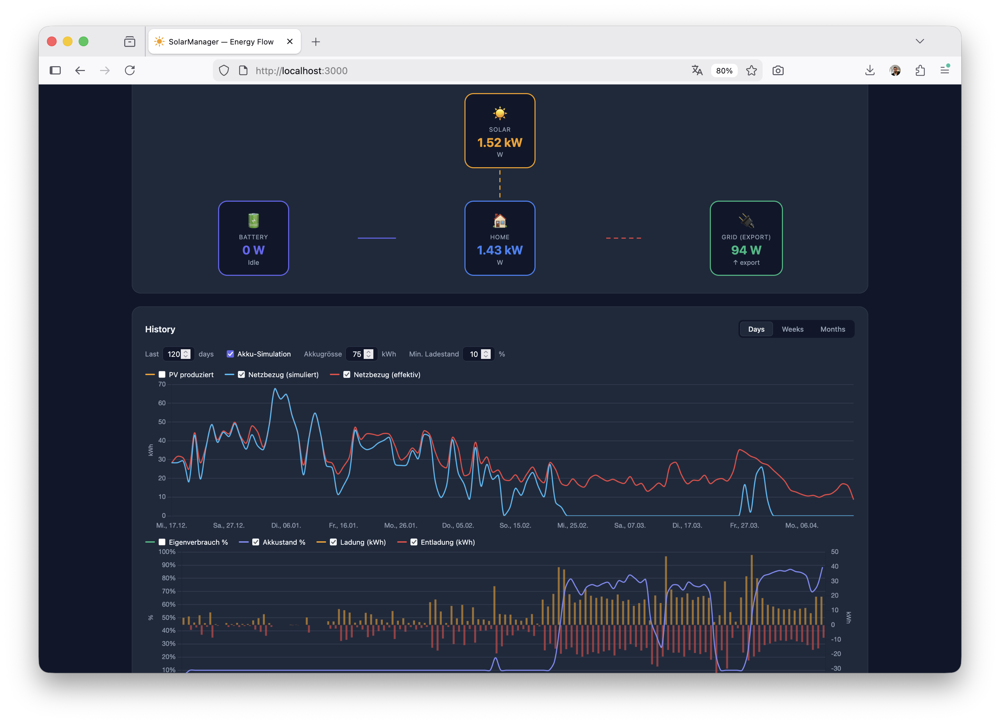

# SolarManager Dashboard

A lightweight local dashboard for visualizing real-time energy flow and statistics from the [SolarManager](https://www.solar-manager.ch) cloud API.



## Features

- Real-time energy flow (solar production, grid, battery, consumption)
- Historical statistics with configurable time range and accuracy
- Tariff information per gateway
- 24-hour file-based API cache to minimize upstream requests

## Requirements

- Node.js 18+
- A SolarManager account with a gateway ID (`smId`) and API credentials

## Setup

```bash
npm install
npm start
```

The server runs at `http://localhost:3000` by default. Set the `PORT` environment variable to override.

## Usage

Open `http://localhost:3000` in your browser. Enter your SolarManager gateway ID and credentials in the dashboard to load your data.
